# Relatório de Bugs - Colmeia QA

**Projeto:** Colmeia - Sistema de Gestão  
**URL de Teste:** https://teste-colmeia-qa.colmeia-corp.com/  
**Data:** 2026-05-08  
**QA Responsável:** [Seu Nome]  
**Ferramenta:** Cypress + Testes Manuais  

---

## Índice

1. [BUG001 - Mensagem de confirmação exibe texto incorreto](#bug001)
2. [BUG002 - Link "Esqueceu sua senha?" não funciona](#bug002)
3. [BUG003 - Mensagem de erro mal posicionada](#bug003)
4. [BUG004 - Modal fecha ao clicar fora](#bug004)
5. [BUG005 - Dropdown "Candidato" não funciona](#bug005)
6. [BUG006 - Botão de menu não intuitivo](#bug006)
7. [BUG007 - Link "Colmeia Forms" não funciona](#bug007)
8. [BUG008 - Modal sem cancelamento](#bug008)
9. [BUG009 - Duplicidade permitida](#bug009)
10. [BUG010 - Salvamento com campo vazio](#bug010)
11. [BUG011 - Caracteres especiais aceitos](#bug011)
12. [BUG012 - Nome longo quebra layout](#bug012)
13. [BUG013 - Refresh remove itens](#bug013)
14. [BUG014 - Arquivados não exibem itens](#bug014)

---

## BUG001 - Mensagem de confirmação exibe texto incorreto {#bug001}

| Atributo | Valor |
|----------|-------|
| **ID** | BUG001 |
| **Severidade** | Baixa |
| **Prioridade** | Baixa |
| **Status** | Aberto |
| **Ambiente** | Homologação (QA) |

### Descrição
Ao inserir credenciais válidas no login, é exibido um popup com a mensagem "Seu login está incorreto, quer continuar?" o que é contraditório, pois as credenciais estão corretas.

### Passos para Reproduzir
1. Acessar a página de login
2. Inserir email válido (qa@test.com)
3. Inserir senha válida (123456)
4. Clicar em "Entrar"

### Resultado Esperado
- Exibir mensagem de confirmação apropriada (ex: "Deseja continuar o login?")
- Ou redirecionar diretamente para o dashboard

### Resultado Atual
- Mensagem "Seu login está incorreto, quer continuar?" é exibida
- Mensagem contraditória causa confusão ao usuário

### Observação Técnica
O popup de confirmação está exibindo texto inadequado para o cenário de sucesso, possivelmente reutilizando o mesmo componente de erro sem ajuste no texto.

### Evidências
**GIF Demonstrativo:**  
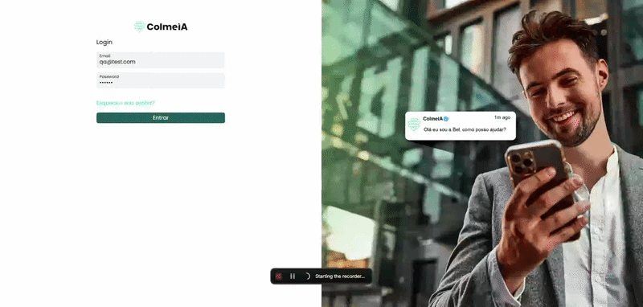

---

## BUG002 - Link "Esqueceu sua senha?" não funciona {#bug002}

| Atributo | Valor |
|----------|-------|
| **ID** | BUG002 |
| **Severidade** | Alta |
| **Prioridade** | Alta |
| **Status** | Aberto |
| **Ambiente** | Homologação (QA) |

### Descrição
O link "Esqueceu sua senha?" apresenta comportamento de elemento clicável (cursor pointer), porém não executa nenhuma ação ao ser clicado.

### Passos para Reproduzir
1. Acessar a página de login
2. Passar o mouse sobre o texto "Esqueceu sua senha?"
3. Clicar no link

### Resultado Esperado
Redirecionar para fluxo de recuperação de senha

### Resultado Atual
Nenhuma ação é executada ao clicar no link

### Observação Técnica
O elemento possui comportamento visual de link (cursor pointer), porém aparenta não possuir evento de clique ou rota associada, indicando possível falha na implementação ou binding de evento.

### Evidência
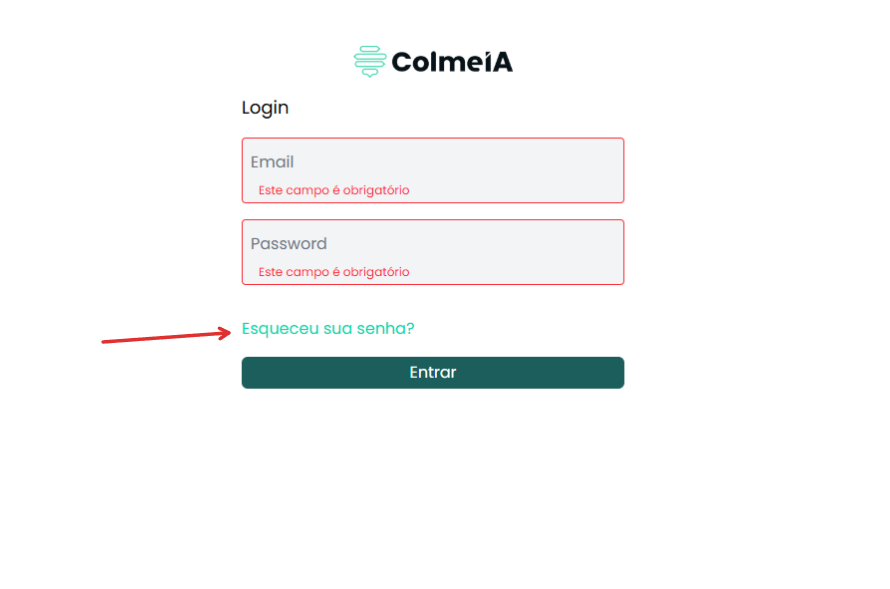

---

## BUG003 - Mensagem de erro mal posicionada {#bug003}

| Atributo | Valor |
|----------|-------|
| **ID** | BUG003 |
| **Severidade** | Baixa |
| **Prioridade** | Baixa |
| **Status** | Aberto |
| **Ambiente** | Homologação (QA) |

### Descrição
Ao inserir credenciais inválidas no login, a mensagem "Usuário ou senha inválidas" é exibida em ambos os campos (email e senha), causando confusão para o usuário. Além disso, a forma como a mensagem é apresentada não é clara nem amigável.

### Passos para Reproduzir
1. Acessar a página de login
2. Inserir email inválido
3. Inserir senha inválida
4. Clicar em "Entrar"

### Resultado Esperado
- Exibir mensagem de erro clara e centralizada (ex: acima do formulário ou abaixo do botão)
- Ou indicar especificamente qual campo está incorreto (quando possível)

### Resultado Atual
- Mensagem exibida em ambos os campos simultaneamente
- Falta de clareza na comunicação do erro

### Observação Técnica
A validação parece não distinguir corretamente o tipo de erro (credencial inválida vs. erro de campo), aplicando a mesma mensagem para múltiplos inputs.

### Evidência
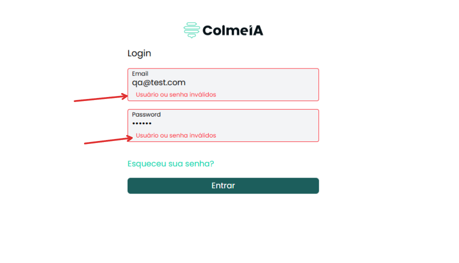

---

## BUG004 - Modal de confirmação fecha ao clicar fora {#bug004}

| Atributo | Valor |
|----------|-------|
| **ID** | BUG004 |
| **Severidade** | Baixa |
| **Prioridade** | Média |
| **Status** | Aberto |
| **Ambiente** | Homologação (QA) |

### Descrição
Ao clicar fora do modal de confirmação exibido após a tentativa de login, a caixa é fechada e o usuário retorna para a tela de login, sendo necessário clicar novamente em "Entrar" para retomar o fluxo.

### Passos para Reproduzir
1. Acessar a página de login
2. Inserir credenciais válidas
3. Clicar em "Entrar"
4. Quando o modal for exibido, clicar fora da caixa de diálogo

### Resultado Esperado
O modal não deve ser fechado ao clicar fora, ou o sistema deve preservar o estado da autenticação sem exigir nova ação do usuário.

### Resultado Atual
O modal fecha, o usuário retorna para a tela de login e precisa clicar novamente em "Entrar".

### Observação Técnica
O modal aparenta permitir dismiss externo sem tratamento adequado do fluxo, causando quebra de experiência e possível perda de estado da ação iniciada.

### Evidência

---

## BUG005 - Dropdown "Candidato" não funciona {#bug005}

| Atributo | Valor |
|----------|-------|
| **ID** | BUG005 |
| **Severidade** | Alta |
| **Prioridade** | Alta |
| **Status** | Aberto |
| **Ambiente** | Homologação (QA) |

### Descrição
O dropdown do usuário não exibe nenhuma opção ao ser clicado.

### Passos para Reproduzir
1. Acessar o sistema logado
2. Clicar em "Candidato" no canto superior direito

### Resultado Esperado
Exibir opções como:
- Perfil
- Configurações
- Logout

### Resultado Atual
Nenhuma ação ocorre ao clicar no dropdown.

### Evidência
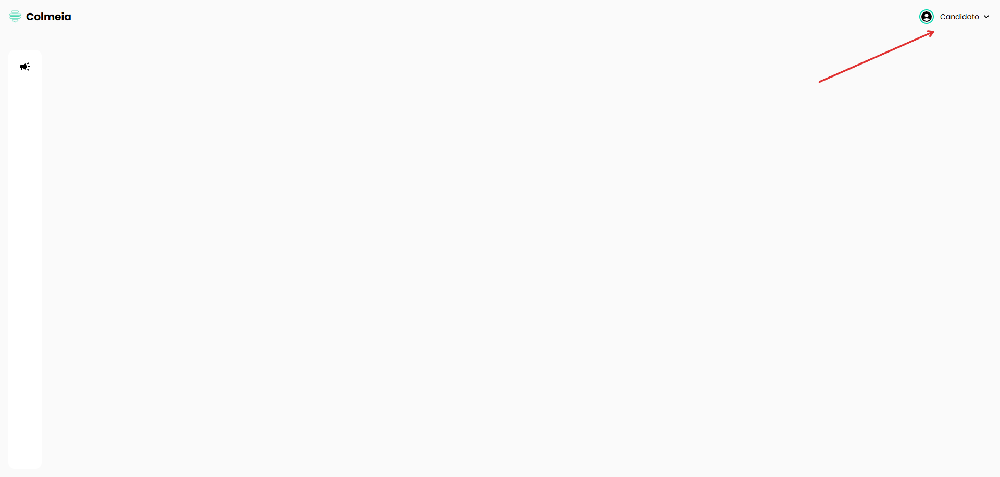

---

## BUG006 - Botão de menu "Campanha" não é intuitivo {#bug006}

| Atributo | Valor |
|----------|-------|
| **ID** | BUG006 |
| **Severidade** | Baixa |
| **Prioridade** | Média |
| **Status** | Aberto |
| **Ambiente** | Homologação (QA) |

### Descrição
O botão representado por um ícone de megafone não é intuitivo para navegação.

### Passos para Reproduzir
1. Acessar o sistema
2. Observar o ícone lateral

### Resultado Esperado
Um ícone mais claro (ex: menu/hamburger)

### Resultado Atual
Usuário não entende a função do botão

### Evidência
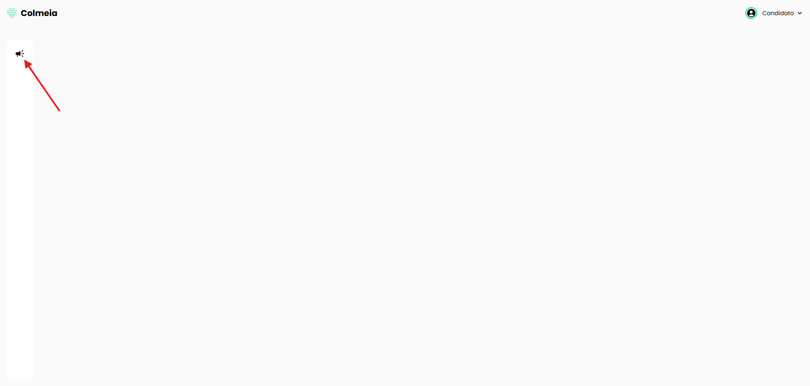

---

## BUG007 - Link "Colmeia Forms" não funciona {#bug007}

| Atributo | Valor |
|----------|-------|
| **ID** | BUG007 |
| **Severidade** | Alta |
| **Prioridade** | Alta |
| **Status** | Aberto |
| **Ambiente** | Homologação (QA) |

### Descrição
O link "Colmeia Forms" não realiza navegação ao ser clicado.

### Passos para Reproduzir
1. Clicar no botão de menu lateral (ícone Megafone)
2. Clicar em "Colmeia Forms"

### Resultado Esperado
Redirecionar para página de formulários

### Resultado Atual
Nenhuma ação ocorre ao clicar no link.

### Observação Técnica
O elemento possui um atributo href (/dashboard/campanha/colmeia-forms), porém a navegação não acontece, indicando possível falha de roteamento ou evento não tratado.

### Evidência
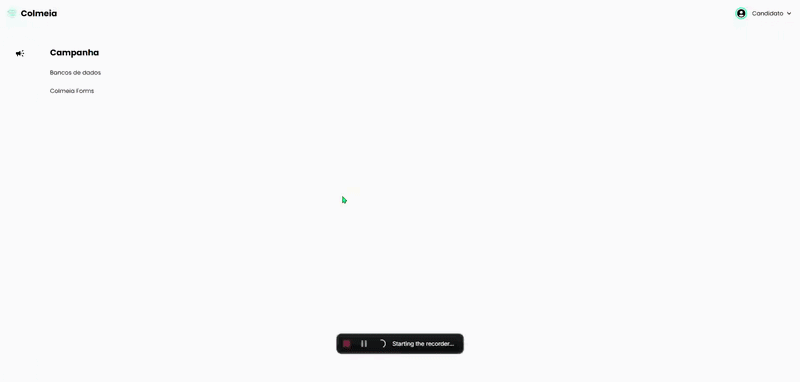

---

## BUG008 - Modal de criação permite fechamento externo e não possui cancelamento {#bug008}

| Atributo | Valor |
|----------|-------|
| **ID** | BUG008 |
| **Severidade** | Baixa |
| **Prioridade** | Média |
| **Status** | Aberto |
| **Ambiente** | Homologação (QA) |

### Descrição
Ao clicar em "Criar" na tela de "Bancos de dados", o modal de criação exibe apenas o botão "Salvar", sem ação de cancelamento. O clique fora fecha o modal e perde os dados digitados.

### Passos para Reproduzir
1. Acessar a tela "Bancos de dados"
2. Clicar em "Criar"
3. Digitar um nome no campo do modal
4. Clicar fora da caixa de diálogo

### Resultado Esperado
- Modal deve possuir botão "Cancelar" ou ícone de fechar
- Clique fora não deve fechar sem confirmação
- Sistema deve preservar o valor digitado

### Resultado Atual
- Modal fecha ao clicar fora
- Dado preenchido é perdido
- Não existe ação explícita de cancelamento

### Observação Técnica
O modal permite dismiss externo sem tratamento do estado do formulário, causando perda de dados e quebra de fluxo.

### Evidência
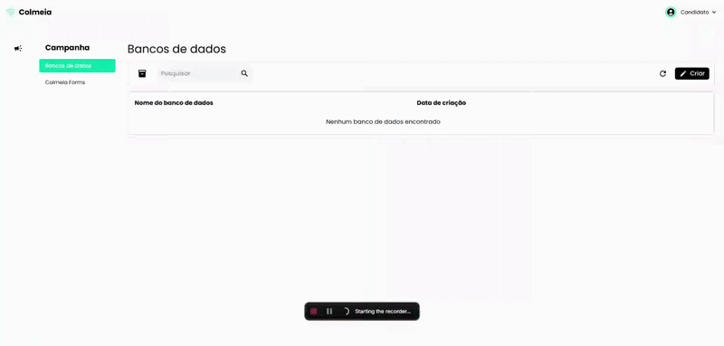

---

## BUG009 - Sistema permite cadastro de itens com mesmo nome (duplicidade) {#bug009}

| Atributo | Valor |
|----------|-------|
| **ID** | BUG009 |
| **Severidade** | Média |
| **Prioridade** | Média |
| **Status** | Aberto |
| **Ambiente** | Homologação (QA) |

### Descrição
Na funcionalidade de criação de itens em "Bancos de dados", o sistema permite cadastrar múltiplos registros com o mesmo nome, sem qualquer mensagem de validação ou aviso.

### Passos para Reproduzir
1. Acessar a tela "Bancos de dados"
2. Clicar em "Criar"
3. Informar um nome de item já existente
4. Clicar em "Salvar"

### Resultado Esperado
O sistema deve:
- Impedir duplicidade, caso o nome deva ser único, ou
- Informar claramente que nomes repetidos são permitidos

### Resultado Atual
O sistema cria múltiplos itens com o mesmo nome sem validação ou feedback.

### Observação Técnica
Não está claro se a duplicidade é permitida por regra de negócio. Na ausência dessa definição, o comportamento deve ser tratado como possível falha de validação.

### Evidência
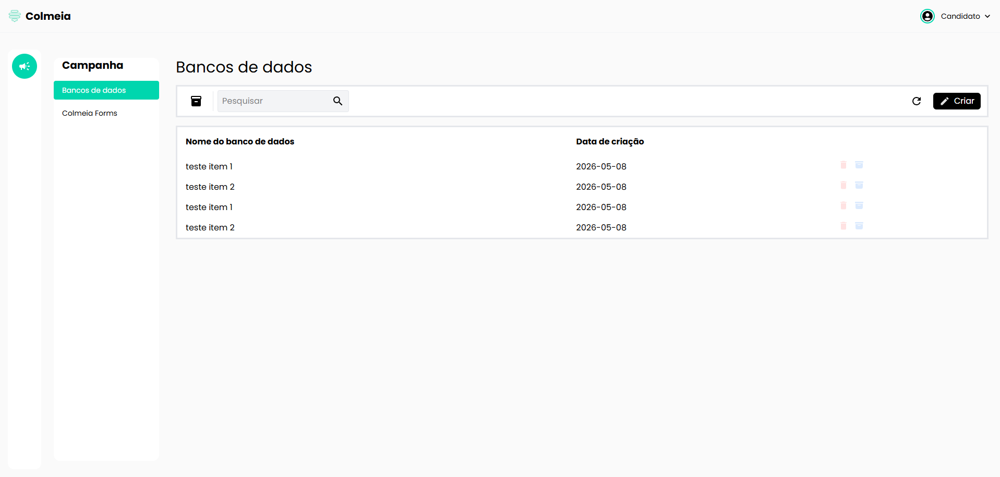

---

## BUG010 - Sistema permite salvar item com campo obrigatório vazio após múltiplas tentativas {#bug010}

| Atributo | Valor |
|----------|-------|
| **ID** | BUG010 |
| **Severidade** | Alta |
| **Prioridade** | Alta |
| **Status** | Aberto |
| **Ambiente** | Homologação (QA) |

### Descrição
Ao tentar criar um item sem preencher o nome, o sistema inicialmente exibe a mensagem de validação informando que o campo é obrigatório. Porém, ao insistir na ação, o item acaba sendo criado mesmo sem valor válido.

### Passos para Reproduzir
1. Acessar a tela "Bancos de dados"
2. Clicar em "Criar"
3. Deixar o campo "Nome do item" vazio
4. Clicar em "Salvar" repetidas vezes ou insistir na ação

### Resultado Esperado
O sistema deve bloquear completamente o salvamento enquanto o campo obrigatório estiver vazio.

### Resultado Atual
Mesmo com a validação exibida, o item acaba sendo criado.

### Observação Técnica
Há inconsistência entre a validação visual e a regra efetiva de persistência, indicando falha na validação do formulário no momento do submit.

### Evidência
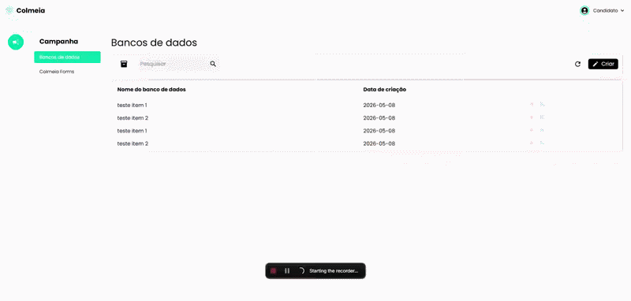

---

## BUG011 - Sistema aceita caracteres especiais sem validação ou regra clara {#bug011}

| Atributo | Valor |
|----------|-------|
| **ID** | BUG011 |
| **Severidade** | Média |
| **Prioridade** | Média |
| **Status** | Aberto |
| **Ambiente** | Homologação (QA) |

### Descrição
A funcionalidade de criação de itens aceita caracteres especiais no nome sem qualquer validação, restrição ou orientação ao usuário.

### Passos para Reproduzir
1. Acessar a tela "Bancos de dados"
2. Clicar em "Criar"
3. Inserir apenas caracteres especiais no campo
4. Clicar em "Salvar"

### Resultado Esperado
O sistema deve validar o formato aceito para o nome do item ou informar claramente que caracteres especiais são permitidos.

### Resultado Atual
O sistema aceita caracteres especiais sem qualquer feedback ou restrição.

### Observação Técnica
Na ausência de regra explícita na interface, o comportamento gera ambiguidade de negócio e risco de inconsistência de dados.

### Evidência
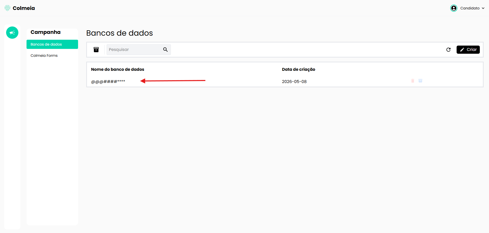

---

## BUG012 - Nome excessivamente longo quebra a exibição da tabela e compromete o layout {#bug012}

| Atributo | Valor |
|----------|-------|
| **ID** | BUG012 |
| **Severidade** | Alta |
| **Prioridade** | Alta |
| **Status** | Aberto |
| **Ambiente** | Homologação (QA) |

### Descrição
Ao cadastrar um item com nome muito longo, a interface não trata adequadamente o conteúdo, causando quebra visual na tabela/listagem.

### Passos para Reproduzir
1. Acessar a tela "Bancos de dados"
2. Clicar em "Criar"
3. Informar um nome muito extenso
4. Clicar em "Salvar"

### Resultado Esperado
O sistema deve limitar o tamanho do campo ou tratar visualmente o conteúdo longo com quebra adequada, truncamento ou tooltip.

### Resultado Atual
A listagem exibe o conteúdo de forma descontrolada, quebrando o layout.

### Observação Técnica
Ausência de validação de tamanho máximo e/ou tratamento visual para overflow de conteúdo.

### Evidência
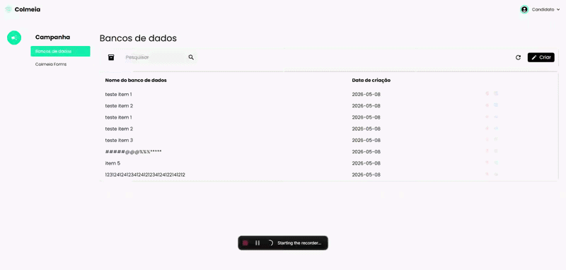

---

## BUG013 - Botão de refresh remove todos os itens da listagem {#bug013}

| Atributo | Valor |
|----------|-------|
| **ID** | BUG013 |
| **Severidade** | Crítica |
| **Prioridade** | Alta |
| **Status** | Aberto |
| **Ambiente** | Homologação (QA) |

### Descrição
Ao clicar no botão de refresh da tela "Bancos de dados", todos os itens da listagem são removidos.

### Passos para Reproduzir
1. Acessar a tela "Bancos de dados"
2. Criar um ou mais itens
3. Clicar no botão de refresh

### Resultado Esperado
O botão deve apenas recarregar os dados da tela, mantendo os registros existentes.

### Resultado Atual
Todos os itens desaparecem da listagem.

### Observação Técnica
A ação de refresh aparenta executar comportamento destrutivo ou reset indevido do estado/dados exibidos.

### Evidência
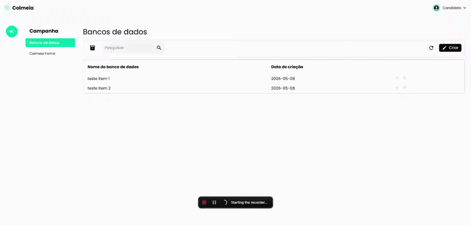

---

## BUG014 - Arquivar item não disponibiliza na visualização de arquivados {#bug014}

| Atributo | Valor |
|----------|-------|
| **ID** | BUG014 |
| **Severidade** | Alta |
| **Prioridade** | Alta |
| **Status** | Aberto |
| **Ambiente** | Homologação (QA) |

### Descrição
Ao arquivar um item, ele deixa de aparecer na listagem principal. Porém, ao acessar a visualização de itens arquivados, nenhum registro é exibido.

### Passos para Reproduzir
1. Acessar a tela "Bancos de dados"
2. Criar um item
3. Arquivar o item
4. Acessar a visualização de arquivados

### Resultado Esperado
O item deve sair da listagem principal e aparecer corretamente na área de arquivados.

### Resultado Atual
O item some da listagem principal, mas não aparece na área de arquivados.

### Observação Técnica
Há indício de falha na persistência do status de arquivamento ou na recuperação/renderização dos itens arquivados.

### Evidência
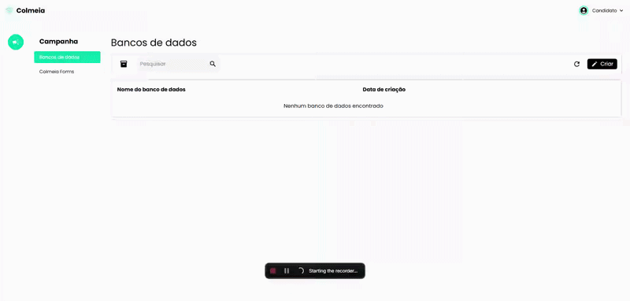

---

## Resumo

| Bug | Severidade | Prioridade | Status |
|-----|------------|------------|--------|
| BUG001 - Mensagem de confirmação incorreta | Baixa | Baixa | Aberto |
| BUG002 - Link "Esqueceu senha" não funciona | Alta | Alta | Aberto |
| BUG003 - Mensagem de erro mal posicionada | Baixa | Baixa | Aberto |
| BUG004 - Modal fecha ao clicar fora | Baixa | Média | Aberto |
| BUG005 - Dropdown não funciona | Alta | Alta | Aberto |
| BUG006 - Botão não intuitivo | Baixa | Média | Aberto |
| BUG007 - Link "Colmeia Forms" não funciona | Alta | Alta | Aberto |
| BUG008 - Modal sem cancelamento | Baixa | Média | Aberto |
| BUG009 - Duplicidade permitida | Média | Média | Aberto |
| BUG010 - Salvamento com campo vazio | Alta | Alta | Aberto |
| BUG011 - Caracteres especiais aceitos | Média | Média | Aberto |
| BUG012 - Nome longo quebra layout | Alta | Alta | Aberto |
| BUG013 - Refresh remove itens | Crítica | Alta | Aberto |
| BUG014 - Arquivados não exibem itens | Alta | Alta | Aberto |

**Total de bugs encontrados:** 14  
**Bugs críticos:** 1  
**Bugs de alta severidade:** 6  
**Bugs de média severidade:** 3  
**Bugs de baixa severidade:** 4
